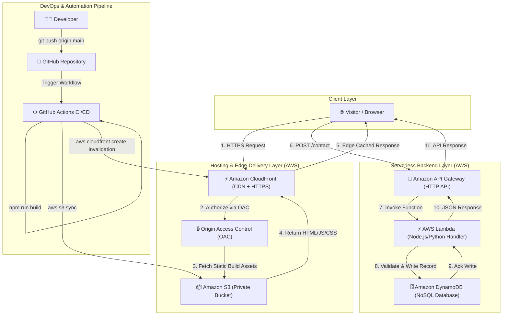
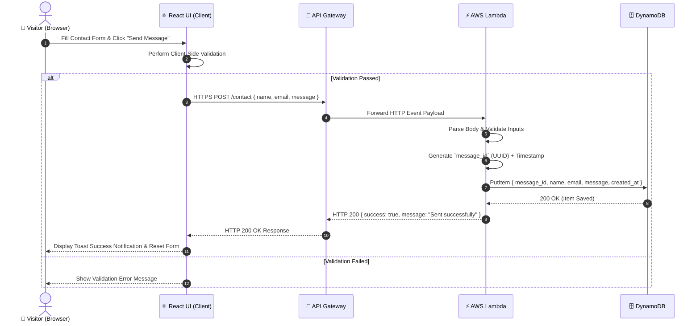
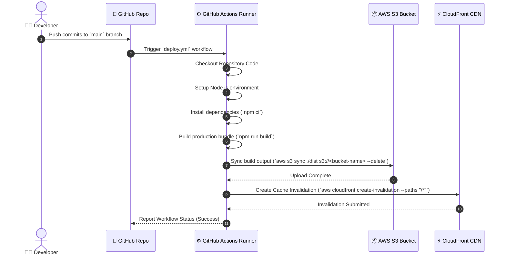

# 🚀 Cloud-Native Serverless Portfolio Website

[](https://reactjs.org/)
[](https://vitejs.dev/)
[](https://tailwindcss.com/)
[](https://aws.amazon.com/s3/)
[](https://aws.amazon.com/cloudfront/)
[](https://aws.amazon.com/lambda/)
[](https://aws.amazon.com/dynamodb/)
[](https://github.com/features/actions)

A modern, high-performance, **cloud-native personal portfolio website** designed with a decoupled architecture: a sleek React single-page application (SPA) frontend delivered securely globally via Amazon CloudFront & private S3, backed by a serverless API (API Gateway + AWS Lambda + DynamoDB), and deployed automatically through a continuous integration and continuous deployment (CI/CD) pipeline using GitHub Actions.

---

## 📌 Executive Summary & Architecture Overview

The primary objective of this project is to showcase developer projects, skills, and background while demonstrating **cloud deployment, serverless architecture, edge CDN caching, modern security practices, and DevOps automation**. 

Instead of manually uploading build files to a server or cloud storage after every update, this project utilizes a fully automated CI/CD pipeline. Pushing changes to the `main` Git branch automatically builds the React application, syncs deployment artifacts to a private Amazon S3 bucket, and invalidates the Amazon CloudFront edge cache.

### ⚡ One-Line Architecture Summary

```text
Runtime (Web Delivery):   User Browser ──► CloudFront (Edge CDN) ──► Private S3 Origin (OAC)
Contact Form (Serverless): User Browser ──► API Gateway ──► AWS Lambda ──► Amazon DynamoDB
DevOps (CI/CD Pipeline):   Developer Push ──► GitHub Actions ──► Build React ──► S3 Sync ──► CloudFront Cache Invalidation
```

---

## 📐 Architecture Diagrams

### 🛠️ End-to-End System Architecture



---

### 📩 Contact Form Sequence Flow



---

### 🔄 CI/CD Pipeline Workflow Sequence



---

## 🎨 Key Features & Component Overview

### Presentation Layer (Frontend)
- **Framework**: React 18 powered by Vite for lightning-fast module bundling and HMR.
- **Styling**: Modern, fluid design built with Tailwind CSS v4, custom utility classes, dark/light theme switching, and glassmorphism cards.
- **Interactive UI**:
  - **Star / Canvas Particle Background**: Dynamic particle animation engine (`StarBackground.jsx`).
  - **Responsive Navbar**: Smooth scrolling navigation bar adapted for desktop and mobile viewports (`Navbar.jsx`).
  - **Hero Section**: Eye-catching introduction with dynamic call-to-action buttons (`HeroSection.jsx`).
  - **About Section**: Highlighting expertise across Full-Stack Web Development, Cloud Computing, and UI/UX design (`AboutSection.jsx`).
  - **Skills Matrix**: Categorized tech stack displaying frontend, backend, cloud, and DevOps competencies (`SkillsSection.jsx`).
  - **Projects Showcase**: Interactive cards featuring project descriptions, tech tags, GitHub links, and live demos (`ProjectsSection.jsx`).
  - **Contact Section**: Asynchronous contact form connected to the serverless backend API with Radix UI toast notifications (`ContactSection.jsx`).

---

## 🔐 Cloud Infrastructure & Security Architecture

### 1. Storage & CDN Layer (S3 + CloudFront)
- **Amazon S3**: Hosts the compiled static assets (`index.html`, JavaScript chunks, CSS files, and media assets). The bucket is strictly private with public access blocked.
- **Amazon CloudFront**: Acts as the global Content Delivery Network (CDN), terminating TLS/HTTPS and serving content from edge locations to minimize latency.
- **Origin Access Control (OAC)**: Replaces legacy OAI to ensure the S3 origin accepts requests **only** from the designated CloudFront Distribution ARN. Direct S3 website endpoint access is completely blocked.

### 2. HTTPS & TLS Termination
- HTTPS is enforced seamlessly via CloudFront's default managed SSL/TLS certificate (`*.cloudfront.net`).
- Communications between client browsers and edge nodes use HTTP/2 & HTTP/3 over TLS 1.3.

### 3. Serverless Backend (API Gateway + Lambda + DynamoDB)
- **Amazon API Gateway**: Exposes a secure, HTTP POST endpoint (`/contact`). Converts incoming client HTTP requests into JSON events for AWS Lambda.
- **AWS Lambda**: A stateless, on-demand compute function that parses input payload, validates email/message formats, generates a unique UUID `message_id` and ISO timestamp, and persists the payload into DynamoDB.
- **Amazon DynamoDB**: Fully managed, auto-scaling NoSQL database storing contact entries with `message_id` as the primary key.

### 4. Security & Least Privilege IAM
- **Zero Exposed Credentials**: The React frontend contains zero AWS IAM keys or database credentials.
- **Role-Based Permissions**: The Lambda execution role contains scoped policies strictly granting `dynamodb:PutItem` on the specific table resource.
- **Backend Isolation**: Direct database access from the browser is impossible; all queries pass through API Gateway validation and Lambda logic.

---

## 🛠️ Tech Stack Matrix

| Layer | Technologies & Tools |
| :--- | :--- |
| **Frontend Framework** | React 18, React DOM, React Router DOM v7 |
| **Build Tooling & Bundler** | Vite 5, PostCSS, ESLint |
| **Styling & UI** | Tailwind CSS v4, Lucide React Icons, Radix UI Toast, Class Variance Authority |
| **Cloud Hosting & CDN** | Amazon S3, Amazon CloudFront (OAC, Edge Caching) |
| **Serverless Backend** | Amazon API Gateway, AWS Lambda (Node.js/Python), Amazon DynamoDB |
| **CI/CD & DevOps** | GitHub Actions, AWS CLI, Git |
| **Contact Form Fallback / Integrations** | EmailJS (`@emailjs/browser`) |

---

## 📂 Repository Directory Structure

```text
Portfolio/
├── .github/
│   └── workflows/
│       └── deploy.yml            # GitHub Actions CI/CD Pipeline Workflow
├── public/                       # Static public assets (favicon, logo, icons)
├── src/
│   ├── assets/                   # Project images and graphic assets
│   ├── components/
│   │   ├── ui/                   # Reusable UI primitives (toast, toaster, etc.)
│   │   ├── AboutSection.jsx      # Professional background & experience
│   │   ├── ContactSection.jsx    # Interactive contact form component
│   │   ├── Footer.jsx            # Footer with social links & copyright
│   │   ├── HeroSection.jsx       # Main landing hero banner
│   │   ├── Navbar.jsx            # Responsive navigation bar
│   │   ├── ProjectsSection.jsx   # Projects gallery section
│   │   ├── SkillsSection.jsx     # Technical skills matrix
│   │   ├── StarBackground.jsx    # Animated canvas background effect
│   │   └── ThemeToggle.jsx       # Dark / Light mode toggle
│   ├── hooks/                    # Custom React hooks (e.g., useToast)
│   ├── lib/                      # Helper utilities (clsx, tailwind-merge)
│   ├── pages/
│   │   ├── Home.jsx              # Main SPA landing page assemble
│   │   └── NotFound.jsx          # 404 fallback page
│   ├── App.jsx                   # Application router & provider wrapper
│   ├── index.css                 # Global CSS & Tailwind styling setup
│   └── main.jsx                  # React application entry point
├── .env.example                  # Environment variables template
├── .gitignore                    # Git ignore patterns
├── index.html                    # Root HTML document
├── package.json                  # Dependencies & npm scripts
├── vite.config.js                # Vite build & alias configuration
└── README.md                     # Project documentation
```

---

## ⚙️ Local Development & Setup Guide

### Prerequisites
- **Node.js**: `v18.0.0` or higher
- **npm**: `v9.0.0` or higher
- **Git**

### Installation Steps

1. **Clone the Repository**
   ```bash
   git clone https://github.com/<your-username>/Portfolio.git
   cd Portfolio
   ```

2. **Install Dependencies**
   ```bash
   npm install
   ```

3. **Configure Environment Variables**
   Copy `.env.example` to `.env` and fill in your configuration:
   ```bash
   cp .env.example .env
   ```
   *Sample `.env` contents:*
   ```env
   VITE_EMAILJS_SERVICE_ID=your_service_id_here
   VITE_EMAILJS_TEMPLATE_ID=your_template_id_here
   VITE_EMAILJS_PUBLIC_KEY=your_public_key_here
   ```

4. **Start Development Server**
   ```bash
   npm run dev
   ```
   Open your browser at `http://localhost:5173` to view the live app.

5. **Linting & Code Verification**
   ```bash
   npm run lint
   ```

6. **Build for Production**
   ```bash
   npm run build
   ```
   The compiled, optimized distribution files will be generated in the `./dist` folder.

---

## 🔄 Deployment & Rollback Workflow

### Deployment Process
1. Commit code changes locally:
   ```bash
   git add .
   git commit -m "feat: enhance project showcase and UI layout"
   ```
2. Push to the `main` branch:
   ```bash
   git push origin main
   ```
3. GitHub Actions automatically executes the pipeline:
   - Compiles React application to `./dist`
   - Uploads new static assets to Amazon S3
   - Creates a CloudFront cache invalidation (`/*`), ensuring global edge locations immediately serve the latest version.

### Rollback Strategy
If an unintended issue is pushed to production:
1. Revert to the last known stable Git commit:
   ```bash
   git revert HEAD
   git push origin main
   ```
2. The CI/CD pipeline automatically rebuilds the stable version, uploads it to S3, and invalidates CloudFront cache.

---

## 📋 Software Engineering Documentation (SRS & SDS Summary)

This project was built following industry-standard **Software Requirements Specification (SRS)** and **Software Design Specification (SDS)** practices:

- **Functional Requirements**: SPA smooth scrolling, responsive layout down to 320px screen width, dark/light theme persistence, interactive project cards, serverless contact form submission, automated CI/CD deployment.
- **Non-Functional Requirements**: High availability (99.9%+ backed by CloudFront/S3), sub-second static page loads via edge caching, zero server administration overhead, strict TLS 1.3 encryption.
- **UML Diagrams Included in Design Docs**:
  - Use Case Diagram
  - Class / Component Object Diagram
  - Activity Diagram
  - Sequence Diagram (Contact submission & Deployment)
  - Deployment Diagram
  - State Machine Diagram (Form states: `idle` → `editing` → `validating` → `submitting` → `success`/`failure`)

---

## 💬 Interview Summary / Elevator Pitch

> *"I engineered a cloud-native personal portfolio using React and Vite, hosted on AWS with a fully automated DevOps deployment pipeline. The static React build is stored in a private Amazon S3 bucket behind an Amazon CloudFront CDN, secured with Origin Access Control (OAC) to prevent direct S3 access.*
> 
> *For dynamic contact functionality, I implemented a serverless backend using Amazon API Gateway, AWS Lambda, and Amazon DynamoDB. When a visitor submits the contact form, the request triggers Lambda via API Gateway to validate and persist the message with a unique UUID in DynamoDB.*
> 
> *To eliminate manual updates, I configured a GitHub Actions CI/CD pipeline. Pushing changes to the main branch automatically builds the frontend, synchronizes the build artifacts to S3, and invalidates the CloudFront edge cache so updates go live instantly across the globe."*

---

## 📄 License

This project is open source and available under the [MIT License](LICENSE).
